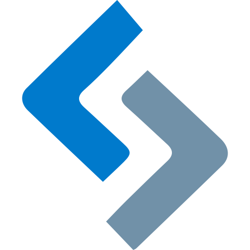

# DOMX

<link rel="icon" type="image/svg+xml" href="images/domx-logo.svg" />

`DOMX` is an approach to building modern web applications using the DOM, browser,
and patterns morso than relying on frameworks.

## Platform Evolution

Historically the web has seen a common pattern. 

We start with proprietary home grown solutions. Some of those solutions
may end up in a library that is shared by the community.
And finally, the browser platform provides its own solution. 

    

### Stage Characteristics

<table>
    <tr>
        <th style="text-align:left">Proprietary</th>
        <th style="text-align:left">Library</th>
        <th style="text-align:left">Browser Platform</th>
    </tr>
    <tr>
        <td>Home grown</td>
        <td>More common</td>
        <td>Standard</td>
    </tr>
    <tr>
        <td>Slower</td>
        <td>Faster</td>
        <td>Fastest</td>
    </tr>
    <tr>
        <td>Least secure</td>
        <td>More secure</td>
        <td>Most secure</td>
    </tr>
    <tr>
        <td>More code to deliver</td>
        <td>Less code to deliver</td>
        <td>No code to deliver</td>
    </tr>
    <tr>
        <td>Write/manage/support</td>
        <td>Version upgrades</td>
        <td>Backwards compatible</td>
    </tr>
</table>

### Examples
This is not an exhaustive list, and there are many libraries and features that could be added.

- DOM querying 
  - **Libraries** - Prototype (2005), JQuery (2006)
  - **Browser** - querySelector, querySelectorAll (2010) 
- HTTP Requests
  - **Libraries** - [prototype](http://api.prototypejs.org/ajax/Ajax/index.html) (2005), [JQuery](https://api.jquery.com/category/ajax/) (2006)
  - **Browser** - Ajax (2001), fetch (2015) 
- String interpolation
  - **Proprietary** - Array.join, [Crockfords .supplant](https://gist.github.com/pbroschwitz/3891293)
  - **Libraries** - [prototype](http://api.prototypejs.org/language/String/prototype/interpolate/index.html)
  - **Browser** - Template literals (2015)
- Promises 
  - **Libraries** - Mochikit (2005), Dojo (2006), CommonJs (2009), JQuery Deferred (2010)
  - **Browser** - Promise (2011-2015), Async/await - language feature (2016) 
- Collection Utilities
  - **Libraries** - Underscore (2019), loadash (2012), Ramda (2013)  
  - **Browser** - Array.map, reduce, filter, find, etc. (2010-2015+)
- Modules - code packaging and delivery and script loaders 
  - **Libraries** - CommonJs Modules (2009), AMD modules (2010), Require.js (2010)
  - **Browser** - ES Modules (2017) 
- Date Manipulation 
  - **Libraries** - Datejs (2007), Moment (2011), Luxon (2017), Dayjs (2018), Date-fns (2016), Spacetime (2017)
  - **Browser**: [Temporal](https://2ality.com/2021/06/temporal-api.html); new platform specific date object at Stage 3.
- Animation / Canvas
  - **Libraries** -  prototype (2005), JQuery (2006-2014), Three.Js (2012), Velocity.Js (2014), Popmotion (2015), Mo-Js (2015), Vivus (2015), Anime.js (2016),  GreenSock (2017) 
  - **Browser** - Canvas (2010), Web Animation API – Spec 2012, Chrome/Firefox 2014 - Experimental 
- UI Components
  - **Libraries** - JQueryUI (2007), ExtJs (2007), Backbone (2010), Angular (2010), Ember (2011), React (2013), Webix (2013), Vue (2014), Svelte (2016), SolidJS (2018)
  - **Browser** - Platform - 2017 
- State Management
  - **Proprietary** Patterns: Observerables, Repositories, Pub/Sub, Flux, UDDF, DDD, etc.
  - **Libraries** - Redux (2015), RxJs (2015), Vuex (2015), Mobx (2016), Akita (2018), Recoil (2020), NgXS (2018), Hookstate (2019) 
  - **Browser** - Only patterns and toos such as localStorage, sessionStorage, IndexDB
- URL Routing 
  - **Libraries** - Ember router (2011), React router (2014), Angular router (2015), navigo (2015), tildeio router (2016)
  - **Browser** - History API - push/replace state (2010)

Why do you need a framework when all of this is built into the browser? Of course,
there will always be a need for libraries. No one wants to build the 483rd date
component by hand and if there is need for intense animations the Web Animation API
probably wont cut it.

However, there are significant long term benefits to sticking with the platform as the
first choice when possible. Standards, backwards compatibility, security, speed.

It does not take any longer to learn how to develop on the browser platform than to learn
any other library or framework. And those skills will be transferrable.

In many cases there is a strong argument to be made that when using libraries and frameworks, the additional complexity can add a significant amount of more code and immediate technical debt.

### Resistance to change 
Each step going from proprietary to library to platform runs up against resistance before adoption. The larger the company backing the library, the higher the resistance due to investment. 

But would you still choose to use prototype.js today? Or choose to use require over import on
any new project?

In some cases we hold onto the past because it is familiar, or we had prior success doing it that way. Learning something new takes time and our current code base already uses the old
thing and we do not want to train devs on the new thing.

And that is part of the beauty of learning and using the platform to its fullest.
It integrates with any technology because it is already there. Anyone can
start today without downloading anything from NPM. Just pull up a chair, a bucket of popcorn,
and start reading MDN. 

And still the web moves forward; where will you be using in 5-10 years? 

### Conclusion
- New language possibilities without transpiling (async/await example) 
- Standards 
- 1 standard 

 Why do we need jQuery when we have querySelectorAll, fetch, and Promise. Why do we need underscore when we have Array.map, .reduce, .find, etc. Why do we need require when we have import. Why do we need any number of UI component builders when we have custom elements? 

Two things that stand out on the list is a router and state management since the platform provides us with the tools to do these things but the patterns may not be as well known.

How to use the DOM for SDDF 

# State Management

The DOMX approach to state management embraces the unidirectional data flow pattern popularized by `FLUX` and `Redux` but relies on API's that already exist in the DOM.

## Use Cases
Why would you consider using a state management solution?
In many cases you do not need one.
For simple CRUD applications with little business logic and clear data boundaries
can manage without any added complexities.

There are a few conditions
- Want a slide to consider the use case and benefits 
- Rationalizing complex data structures and flow 
- Centralizing and decoupling data 
- What does that give us 
- Predictable state from many moving parts 

## How to Implement

## Comparisons 

### Flux
What problems does flux solve? 

### React / Redux

    

### DOM Flux

---

    

